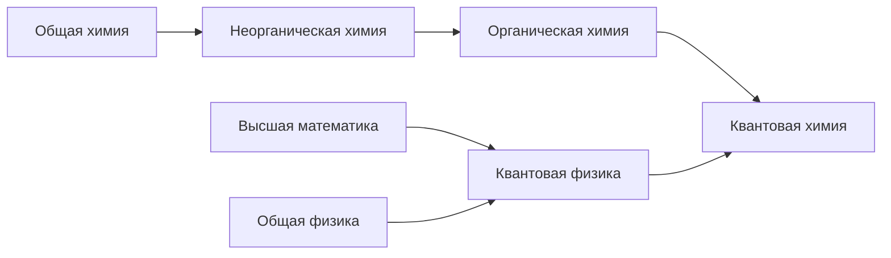

# Образовательные треки

## Специальности

### Антиэйдж-биолог

Исследует старение организмов, его причины и механизмы, а также способы его замедления, остановки и инверсии.

Примеры задач:

1. Поиск эпигенетических модификаций клеток человека, продлевающих healthy lifespan.
2. Модификация генных групп в культуре половых клеток мыши для получения долгоживущих особей.

##### Предметы

* [Общая биология](#общая-биология)
* [Общая химия](#общая-химия)
* Высшая математика
* Математическая статистика
* Органическая химия
* Молекулярная биология
* Биохимия
* [Цитология](#цитология)
* Гистология
* Анатомия человека
* Нормальная физиология
* Эмбриология
* [Генетика](#генетика)
* [Генная инженерия](#Генная-инженерия)
* [Эпигенетика](#эпигенетика)
* Иммунология
* [Методы клеточной биологии](#Методы-клеточной-биологии)
* Системная биология старения
* [Геронтология](#геронтология)

### Антиэйдж-химик

Исследует процессы старения на молекулярном уровне, разрабатывает новые физикохимические способы исследования и модификации этих процессов.

Примеры задач:

1. Разработка молекулярного комплекса, который способен разлагать конечные продукты гликирования в межклеточном матриксе, и при этом не разрушает сами клетки и легко доставим в место своей реакции.
1. Поиск эффективных методов картирования эпигенома в различных тканях организма

##### Предметы

* [Общая биология](#общая-биология)
* [Общая химия](#общая-химия)
* Высшая математика
* Дифференциальные уравнения
* Линейная алгебра
* [Неорганическая химия](#неорганическая-химия)
* [Органическая химия](#органическая-химия)
* Молекулярная биология
* [Биохимия](#биохимия)
* [Цитология](#цитология)
* Аналитическая химия
* [Физическая химия](#физическая-химия)
* [Химическая термодинамика](#химическая-термодинамика)
* Статистическая физика
* [Квантовая химия](#квантовая-химия)
* [Строение молекул](#строение-молекул)
* Биоорганическая химия
* [Кристаллохимия](#кристаллохимия)
* [Органический синтез](#органический-синтез)
* Фармакология
* [Химическая технология](#химическая-технология)
* [Нанохимия и нанотехнологии](#нанохимия-и-нанотехнологии)
* [Инженерная энзимология](#инженерная-энзимология)

### Антиэйдж-биоинформатик

Исследует процессы старения на моделях организма in silico (на компьютере).

Примеры задач:

1. Поиск групп генов, оказывающих влияние на процессы старения, путем анализа биологических путей в полногеномной метаболической модели клетки.
<!-- 2. Разработка алгоритмов предсказания формы белка по его аминокислотной последовательности. -->

##### Предметы

* [Общая биология](#общая-биология)
* [Общая химия](#общая-химия)
* Аналитическая геометрия
* Линейная алгебра
* Математический анализ
* Математическая статистика
* [Основы Computer Science](основы-computer-science)
* [Язык программирования Python](язык-программирования-python)
* [Функциональное программирование](функциональное-программирование)
* Объектно-ориентированное программирование
* Методы разработки программного обеспечения
* [Биоинформатика](#биоинформатика)
* [IT инструментарий научной работы](#it-инструментарий-научной-работы)
* [Инженерия знаний](инженерия-знаний)
* [Моделирование химических структур](#моделирование-химических-структур)
* [Машинное обучение](#машинное-обучение)
* Генетические алгоритмы
* Параллельные вычисления
* Квантовые вычисления

--------------------------

## Учебные материалы по предметам

### Анатомия

Книги

* Анатомия и физиология для чайников, Эрин Одья

### Биоинформатика

* [Биоинформатика, Миронов А.А., МГУ ФБиБ](https://www.youtube.com/playlist?list=PLcsjsqLLSfNCXR1AaXbADeXyQYr96JXke) (17 лекций, 21 час 30 минут)

### Биохимия

* [Введение в биорганическую химию, Шноль С.Э., МГУ Химфак](https://www.youtube.com/playlist?list=PLcsjsqLLSfNAxcnQljyEH4AxVyMRBqJq_) (8 лекций, 11 часов) - <i>Фактически, история биохимии</i>
* [Биохимия, Гладилин А.К., МГУ Химфак](https://www.youtube.com/playlist?list=PLcsjsqLLSfNAr3oCbu46cYVR_cGOY0tI1) (25 лекций, 29 часов)
* [Биоорганическая химия I, Зык Н.В., МГУ Химфак](https://www.youtube.com/playlist?list=PLcsjsqLLSfNCbic22WnhfoL7k_xlmLur8) (19 лекций, 23 часа)
* [Биоорганическая химия II, Зык Н.В., МГУ Химфак](https://www.youtube.com/playlist?list=PLcsjsqLLSfND2es6QmFfBbLoIeNzdpFWx) (10 лекций, 12 часов 30 минут)

Книги

* Биохимия для чайников, Джон Мур

### Вирусология

Книги

* Вирусология, под ред. Пиневича
* [Introduction to modern virology, N. Dimmock](https://disk.yandex.ru/i/fImLskaf38ttFg) (531 страница)
* Principles of Virology (2 тома)

### Генетика

Книги

* Основы генетики, Уильям Клаг
* Геномы, Терри Браун
* [Гены по Льюину](https://disk.yandex.ru/i/M2KvlI6zWRQJGQ) (893 страницы)

### Генная инженерия

Книги

* Редактирование генов и геномов, Закинян С.М. (3 тома, 1000 стираниц)

### Геронтология

* [Геронтология, Фенюк Б.А., МГУ ФБиБ](https://www.youtube.com/playlist?list=PLcsjsqLLSfNAsNTlgoIkFccdyf_0Ehq-w) (10 лекций, 13 часов)

### Инженерия знаний

* [Графы знаний, Галкин М.Л., ИТМО](https://www.youtube.com/playlist?list=PLlmfdv64-P33ROIzuATAWEp0V1jMXAoj_) (11 лекций, 12 часов)

### Инженерная энзимология

* [Инженерная энзимология и аналитическая биотехнология, Курочкин И.Н., МГУ Химфак](https://www.youtube.com/playlist?list=PLcsjsqLLSfNBvR2qhdwSzzb6hlnNaJLD8) (4 лекции, 4 часа)

### Квантовая химия

* [Квантовая химия, Новаковская Ю.В., МГУ Химфак](https://www.youtube.com/playlist?list=PLcsjsqLLSfNAXa-EZeVmFijBKZ4rG7-ck) (13 лекций, 19 часов)

### Кристаллохимия

* [Кристаллохимия, Словохотов Ю.Л., МГУ Химфак](https://www.youtube.com/playlist?list=PLcsjsqLLSfNA3iLw1oaNj1jiiYRihbqvZ) (15 лекций, 22 часа)

### Машинное обучение

* [Машинное обучение в структурной биологии, Головин А.В., МГУ ФБиБ](https://www.youtube.com/playlist?list=PLcsjsqLLSfND6VrwJ_XVkuJnwPZRCKn97) (7 лекций, 10 часов 30 минут)

### Методы клеточной биологии

Книги

* Культура животных клеток, Р. Фрешни

### Моделирование химических структур

* [Моделирование структур биополимеров, Головин А.В., МГУ ФБиБ](https://www.youtube.com/playlist?list=PLcsjsqLLSfND7PZXkmTJI4AniRgIuIxrM) (12 лекций, 13 часов)

### Молекулярная биология

Книги

* Молекулярная биология клетки, Альбертс Б. (3 тома, 2500 страниц)

### Нанохимия и нанотехнологии

* [Основы нанохимии и нанотехнологий, Лебедев А., ЯрГУ](https://www.youtube.com/playlist?list=PL_oqxSpsa5FcnKHi80yMcqhW_x8R-3heZ) (35 лекций, 27 часов)

### Нейрофизиология

Книги

* Нейронауки для чайников, Фрэнк Амтор

### Неорганическая химия

* [Неорганическая химия I, Гудилин Е.А., Шевельков А.В., МГУ Химфак](https://www.youtube.com/playlist?list=PLcsjsqLLSfNC6uqQUAP3j08FZIm_frFrP) (26 лекций, 36 часов)
* [Неорганическая химия II, Шевельков А.В., Гудилин Е.А., МГУ Химфак](https://www.youtube.com/playlist?list=PLcsjsqLLSfNAf2VGoLFdqwE2pwykwZi8H) (23 лекции, 32 часа)
* [Теоретическая неорганическая химия I, Леменовский Д.А., МГУ Химфак](https://www.youtube.com/playlist?list=PLcsjsqLLSfNBWv5gqr1IUey0CcCBMhKIw) (13 лекций, 17 часов)
* [Теоретическая неорганическая химия II, Леменовский Д.А., МГУ Химфак](https://www.youtube.com/playlist?list=PLcsjsqLLSfNCqp4S4Wm0197Us3XeBnRsl) (13 лекций, 15 часов)

### Общая биология

* [100 часов школьной биологии, Дубынин В.А., МГУ Биофак - 1](https://www.youtube.com/playlist?list=PLcsjsqLLSfNDHFikQVZd2XOqF5FK56L3D) (29 уроков, 33 часа)
* [100 часов школьной биологии, Дубынин В.А., МГУ Биофак - 2](https://www.youtube.com/playlist?list=PLcsjsqLLSfNDiVZaaNUWI0vEKdKZv5J8U) (11 уроков, 16 часов)
* [Общая биология, Асеев В.В., МГУ Биофак](https://www.youtube.com/playlist?list=PLcsjsqLLSfNDiVZaaNUWI0vEKdKZv5J8U) (13 лекций, 19 часов)
* [Introduction to Biology, Eric Lander, MIT](https://www.edx.org/course/introduction-to-biology-the-secret-of-life-3) (16 недель, 5-10 часов в неделю)

Книги

* Биология, 5-11 класс, Пасечкин В.В.
* Биология для чайников, Рене Ф. Кратц
* Биология, Д.Тейлор, Н.Грин (3 тома)
* Биология Campbell, Лиза А. Урри (1 том на русском, 2-3 том только на английском)

### Общая химия

* [Общая химия, Ерёмин В.В., МГУ Физфак](https://www.youtube.com/playlist?list=PLcsjsqLLSfNDHFikQVZd2XOqF5FK56L3D) (7 уроков, 9 часов 30 минут)

Книги

* Химия, 8-11 класс, Рудзитис Г.Е.
* Химия, 8-11 класс, Габриелян О.С.
* Химия для чайников, Джон Мур

Сайты

* [Webelements - интерактивная таблица Менделеева](https://www.webelements.com/)

### Органическая химия

* [Органическая химия I, Лукашев Н.В., МГУ Химфак](https://www.youtube.com/playlist?list=PLcsjsqLLSfNALYL33eBd-kC4JpfJXMeu7) (24 лекции, 33 часа 30 минут)

### Органический синтез

* [Органический синтез I, Дядченко В.П., МГУ Химфак](https://www.youtube.com/playlist?list=PLcsjsqLLSfNCkut4Mrh0M3TDaMz42xmA3) (28 лекций, 36 часов)
* [Органический синтез II, Дядченко В.П., МГУ Химфак](https://www.youtube.com/playlist?list=PLcsjsqLLSfNB2kdA3bUJ1S2rVzX6Z6ekU) (16 лекций, 23 часа)

### Основы Computer Science

* [Введение в программирование, Hexlet](https://ru.hexlet.io/courses/introduction_to_programming) (~24 часов обучения)
* [Информатика, Миронов А.А., МГУ ФБиБ](https://www.youtube.com/playlist?list=PLcsjsqLLSfNDR0FUWJZIy8BgE1YUAhDXT) (16 лекций, 21 час)

### Строение молекул

* [Строение молекул, Новаковская Ю.В., МГУ Химфак](https://www.youtube.com/playlist?list=PLcsjsqLLSfNDGxeTHfnkCcYUHJGsePP5G) (16 лекций, 24 часа)

### Физическая химия

* [Физическая химия I, Коробов М.В., МГУ Химфак, 3 курс](https://www.youtube.com/playlist?list=PLcsjsqLLSfNDs6zqdpUhHfRh4xbEMIoLD) (25 лекций, 35 часов)
* [Физическая химия II, Коробов М.В., МГУ Химфак, 3 курс](https://www.youtube.com/playlist?list=PLcsjsqLLSfNBrBhaaco12BK7VktmAT9hK) (20 лекций, 27 часов)
* [Химическая термодинамика и кинетика, Успенская И.А., МГУ Химфак, 4 курс](https://www.youtube.com/playlist?list=PLcsjsqLLSfND055iOW8nmyYnBVtNXMOIr) (20 лекций, 25 часов)

### Функциональное программирование

* [Язык Clojure](https://clojurecourse.by/) (17 часов видео-уроков)

### Химическая технология

* [Химическая технология, Лазоряк Б.И., Хейфец Л.И., МГУ Химфак](https://www.youtube.com/playlist?list=PLcsjsqLLSfNAXa-EZeVmFijBKZ4rG7-ck) (22 лекции, 31 час)

### Цитология

* [Основы биологии клетки, Окштейн И.Л., МФТИ](https://www.youtube.com/playlist?list=PLwg7NW3ZH-fX2HGMrhXNvQjJtwpE9ORTz) (11 лекций, 14 часов)

Книги

* [Клетки по Льюину](https://disk.yandex.ru/i/G12oyE6_cs6zsA) (941 страница)

### Эпигенетика

* [Лекция по эпигенетике, Янов А., Open Longevity](https://www.youtube.com/watch?v=mwItQXwdIMI) (2 часа)

Книги

* Эпигенетика, под редакцией Эллиса С.Д.

### Эмбриология

Книги

* Биология развития, М. Барреси, С. Гилберт

### Язык программирования Python

* [Основы языка Python, Hexlet](https://ru.hexlet.io/courses/python-basics) (~56 часов обучения)

### IT инструментарий научной работы

* [Введение в Git, Hexlet](https://ru.hexlet.io/courses/intro_to_git) (16 уроков, ~18 часов обучения)
* [Анализ данных в среде R](https://www.youtube.com/playlist?list=PLwwk4BHih4fj1p79gMWSk0M-DaYJ9teiN) (18 уроков, 6 часов)

