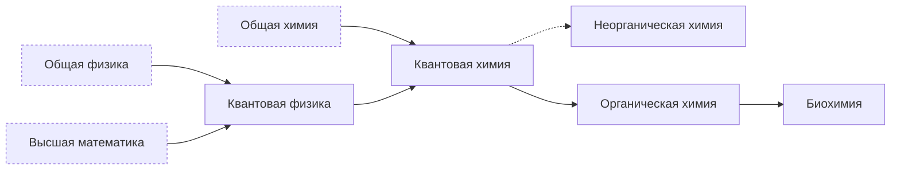

# Треки обучения

Порядок освоения курсов.

## Понять, как работает клетка

```mermaid
flowchart LR;
    Mgen[Высшая математика]:::cond;
    Phgen[Общая физика]:::cond;
    Phq[Квантовая физика];
    Chgen[Общая химия]:::cond;
    Chnorg[Неорганическая химия];
    Chorg[Органическая химия];
    Chq[Квантовая химия];
    Bioch[Биохимия];

    Chgen --> Chq --> Chorg --> Bioch;
    Chq -.-> Chnorg;
    Phgen --> Phq --> Chq;
    Mgen --> Phq;

    classDef cond stroke-dasharray:3;

    click Chorg "https://github.com/prozion/anti-aging-education/#органическая-химия" _blank
    click Chq "https://github.com/prozion/anti-aging-education/#квантовая-химия" _blank
```
